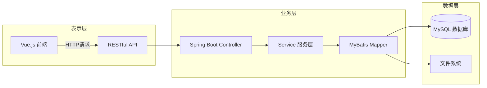

```mermaid
%%{init: {'theme': 'default', 'themeVariables': { 'background': '#ffffff'}}}%%
graph LR
    subgraph "表示层"
        A[Vue.js 前端]
        B[RESTful API]
    end

    subgraph "业务层"
        C[Spring Boot Controller]
        D[Service 服务层]
        E[MyBatis Mapper]
    end

    subgraph "数据层"
        F[(MySQL 数据库)]
        G[文件系统]
    end

    A -->|HTTP请求| B
    B --> C
    C --> D
    D --> E
    E --> F
    E --> G
```